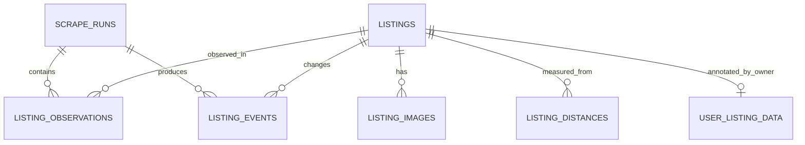

# M1-01 – Finální návrh databázového schématu

- Stav návrhu: schválený pro implementaci v `M1-02`
- Datum: 2026-08-11
- Databáze: PostgreSQL 16+
- Vstupy: `specifikace.md`, anonymizované fixtures a profily dat z 2. a 11. srpna 2026

## 1. Návrhové zásady

- PostgreSQL je autoritativní úložiště normalizovaného současného stavu a historie.
- Interní vazby používají databázové `bigint` identity. Sreality ID je externí přirozený identifikátor a má samostatné unikátní omezení.
- Časy jsou `timestamptz` v UTC. Částky jsou celé haléřově nedělené CZK v `bigint`.
- Zdrojová cena `0` se ukládá do `source_price_czk`, ale analytické `price_czk` je `NULL` a `price_on_request = true`.
- Neznámé a málo stabilní parametry se zachovávají v JSONB. Pole potřebná pro filtry, historii a invarianty mají vlastní typované sloupce.
- Chybějící zdrojová hodnota je `NULL`; prázdný řetězec ani nula ji nenahrazují.
- Nabídky a jejich historie se v běžném provozu fyzicky nemažou. Cizí klíče historických tabulek proto používají `ON DELETE RESTRICT`.
- Všechny plochy jsou celé m² podle pozorovaného kontraktu. Vzdálenosti používají `numeric`, protože jde o odvozené hodnoty zobrazované s omezenou přesností.

## 2. ER model

`listing_observations` je spojovací historická entita mezi během a nabídkou. Přítomnost řádku znamená, že nabídka byla v daném běhu skutečně nalezena a její detail byl zpracován alespoň do uloženého stavu.

## 3. Doménové typy

V první migraci vzniknou PostgreSQL enumy:

| Typ | Hodnoty |
| --- | --- |
| `listing_kind` | `chata`, `chalupa` |
| `scrape_run_trigger` | `scheduled`, `manual` |
| `scrape_run_status` | `running`, `succeeded`, `partial`, `failed` |
| `listing_event_type` | `created`, `price_decreased`, `price_increased`, `details_changed`, `deactivated`, `reactivated` |
| `image_archive_status` | `source_only`, `pending`, `archived`, `failed` |

Nové hodnoty se přidávají migrací. Externí codebook hodnoty Sreality nejsou databázové enumy, protože nejsou stabilním veřejným kontraktem.

## 4. Tabulky

### 4.1 `scrape_runs`

| Sloupec | Typ | NULL | Pravidlo |
| --- | --- | --- | --- |
| `id` | `uuid` | ne | PK, generováno aplikací; používá se jako `run_id` v logu a raw object key |
| `logical_key` | `varchar(160)` | ne | unikátní idempotency key plánovaného nebo ručního běhu |
| `trigger` | `scrape_run_trigger` | ne | způsob spuštění |
| `status` | `scrape_run_status` | ne | výchozí `running` |
| `started_at` | `timestamptz` | ne | čas zahájení |
| `finished_at` | `timestamptz` | ano | až po ukončení |
| `chata_complete` | `boolean` | ne | výchozí `false` |
| `chalupa_complete` | `boolean` | ne | výchozí `false` |
| `found_count` | `integer` | ne | výchozí 0 |
| `new_count` | `integer` | ne | výchozí 0 |
| `changed_count` | `integer` | ne | výchozí 0 |
| `error_count` | `integer` | ne | výchozí 0 |
| `deactivated_count` | `integer` | ne | výchozí 0 |
| `scraper_version` | `varchar(64)` | ne | verze pipeline |
| `error_code` | `varchar(120)` | ano | strojově čitelná příčina |
| `error_summary` | `text` | ano | stručná sanitizovaná chyba, bez payloadu a secrets |

Omezení:

- `UNIQUE (logical_key)` zabrání opakovanému založení stejného logického běhu.
- Všechny počty mají `CHECK (value >= 0)`.
- `finished_at >= started_at`, pokud je konec vyplněn.
- Stav `succeeded` vyžaduje konec a oba příznaky úplnosti. Deaktivace je povolena pouze pro takový běh.

Indexy: `(status, started_at DESC)` a `started_at DESC`.

### 4.2 `listings`

| Sloupec | Typ | NULL | Význam |
| --- | --- | --- | --- |
| `id` | `bigint generated always as identity` | ne | PK |
| `sreality_id` | `bigint` | ne | externí ID, unikátní |
| `kind` | `listing_kind` | ne | chata/chalupa |
| `source_url` | `text` | ne | kanonický veřejný detail |
| `is_active` | `boolean` | ne | výchozí `true` |
| `first_seen_at` | `timestamptz` | ne | první pozorování |
| `last_seen_at` | `timestamptz` | ne | poslední pozorování |
| `inactive_at` | `timestamptz` | ano | pouze pro neaktivní nabídku |
| `source_price_czk` | `bigint` | ano | původní číselná hodnota včetně 0 |
| `price_czk` | `bigint` | ano | normalizovaná analytická cena |
| `price_on_request` | `boolean` | ne | výchozí `false` |
| `currency_code` | `varchar(3)` | ano | typicky `CZK` |
| `source_price_per_sqm_czk` | `bigint` | ano | zdrojová hodnota, není autoritativní výpočet |
| `derived_price_per_sqm_czk` | `bigint` | ano | cena / vhodná nenulová plocha |
| `name` | `text` | ano | zdrojový nadpis |
| `description` | `text` | ano | zdrojový popis beze změny |
| `price_note` | `text` | ano | text k ceně |
| `locality_text` | `text` | ano | zdrojově zobrazená lokalita |
| `country` | `text` | ano | země |
| `region` / `district` / `municipality` | `text` | ano | normalizované názvy |
| `region_source_id` / `district_source_id` / `municipality_source_id` | `bigint` | ano | zdrojové codebook ID |
| `latitude` / `longitude` | `double precision` | ano | musí být vyplněny společně a v platném rozsahu |
| `location_inaccuracy` | `varchar(80)` | ano | přesnost/typ polohy ze zdroje |
| `usable_area_m2` | `integer` | ano | `params.usableArea` |
| `land_area_m2` | `integer` | ano | `estateArea` |
| `building_area_m2` | `integer` | ano | `params.buildingArea` |
| `floor_area_m2` | `integer` | ano | `params.floorArea` |
| `garden_area_m2` | `integer` | ano | `params.gardenArea` |
| `building_condition_code` / `building_type_code` / `object_type_code` | `integer` | ano | hodnoty zdrojových codebooků |
| `room_count_code` / `energy_rating_code` | `integer` | ano | hodnoty zdrojových codebooků |
| `content_hash` | `char(64)` | ne | SHA-256 normalizovaného relevantního detailu |
| `detail_changed_at` | `timestamptz` | ne | poslední významná změna detailu |
| `params_json` | `jsonb` | ne | úplný objekt `params`, výchozí `{}` |
| `source_extra_json` | `jsonb` | ne | další nepromítnutá detailní data, výchozí `{}` |
| `created_at` / `updated_at` | `timestamptz` | ne | databázová auditní metadata |

Omezení:

- `UNIQUE (sreality_id)`.
- Ceny a plochy jsou `NULL` nebo nezáporné.
- `price_on_request = true` znamená `price_czk IS NULL`.
- Pokud je `source_price_czk = 0`, musí být `price_czk IS NULL` a `price_on_request = true`.
- Zeměpisná šířka a délka jsou buď obě `NULL`, nebo obě vyplněné; rozsahy jsou `[-90, 90]` a `[-180, 180]`.
- `is_active = true` znamená `inactive_at IS NULL`; neaktivní řádek má `inactive_at` vyplněn.
- `first_seen_at <= last_seen_at` a `detail_changed_at >= first_seen_at`.

Indexy:

- částečný `(kind, region, district)` pro `WHERE is_active`;
- částečné B-tree indexy `price_czk`, `usable_area_m2`, `land_area_m2`, `derived_price_per_sqm_czk` pro `WHERE is_active`;
- `(is_active, last_seen_at DESC)` pro stavové a provozní dotazy;
- GIN na `params_json` se nepřidává v první migraci; vznikne až po doložení konkrétního JSON dotazu.

### 4.3 `listing_observations`

| Sloupec | Typ | NULL | Význam |
| --- | --- | --- | --- |
| `id` | `bigint identity` | ne | PK |
| `listing_id` | `bigint` | ne | FK na `listings`, `ON DELETE RESTRICT` |
| `run_id` | `uuid` | ne | FK na `scrape_runs`, `ON DELETE RESTRICT` |
| `observed_at` | `timestamptz` | ne | čas pozorování |
| `source_price_czk` / `price_czk` | `bigint` | ano | zdrojová a normalizovaná cena |
| `price_on_request` | `boolean` | ne | stejná cenová invariantní pravidla jako u `listings` |
| `usable_area_m2` / `land_area_m2` / `building_area_m2` | `integer` | ano | historicky analytické plochy |
| `derived_price_per_sqm_czk` | `bigint` | ano | historická odvozená hodnota |
| `detail_hash` | `char(64)` | ne | hash zpracovaného detailu |
| `raw_object_key` | `text` | ano | odkaz na komprimovaný raw payload |
| `snapshot_json` | `jsonb` | ne | kompaktní normalizovaný snapshot pro audit, výchozí `{}` |

Omezení a indexy:

- `UNIQUE (listing_id, run_id)` je hlavní idempotentní pojistka pozorování.
- Index `(run_id, price_czk) WHERE price_czk IS NOT NULL` podporuje týdenní medián.
- Index `(listing_id, observed_at DESC)` podporuje historii nabídky.
- BRIN na `observed_at` se přidá až při objemu, kde bude výhodnější než B-tree.

### 4.4 `listing_events`

| Sloupec | Typ | NULL | Význam |
| --- | --- | --- | --- |
| `id` | `bigint identity` | ne | PK |
| `listing_id` | `bigint` | ne | FK `RESTRICT` |
| `run_id` | `uuid` | ne | FK `RESTRICT` |
| `event_type` | `listing_event_type` | ne | typ změny |
| `occurred_at` | `timestamptz` | ne | čas události |
| `old_price_czk` / `new_price_czk` | `bigint` | ano | pouze pro cenové události |
| `changes_json` | `jsonb` | ne | strojově čitelné změny, výchozí `{}` |

`UNIQUE (run_id, listing_id, event_type)` zabraňuje duplicitní události stejného typu v jednom běhu. Index `(listing_id, occurred_at DESC)` slouží časové ose a `(event_type, occurred_at DESC)` provozním přehledům.

### 4.5 `listing_images`

| Sloupec | Typ | NULL | Význam |
| --- | --- | --- | --- |
| `id` | `bigint identity` | ne | PK |
| `listing_id` | `bigint` | ne | FK `RESTRICT` |
| `source_image_id` | `text` | ano | zdrojové ID, pokud existuje |
| `source_url` | `text` | ne | veřejná zdrojová URL |
| `source_fingerprint` | `char(64)` | ne | SHA-256 stabilního ID nebo kanonické URL |
| `position` | `integer` | ne | pořadí v posledním detailu |
| `width` / `height` | `integer` | ano | deklarované pixely |
| `first_seen_at` / `last_seen_at` | `timestamptz` | ne | životní cyklus metadata |
| `archive_object_key` | `text` | ano | neveřejný GCS/local object key |
| `archive_status` | `image_archive_status` | ne | výchozí `source_only` |
| `content_hash` | `char(64)` | ano | SHA-256 staženého souboru |
| `last_error` | `text` | ano | sanitizovaná poslední chyba archivace |

`UNIQUE (listing_id, source_fingerprint)` zajišťuje deduplikaci. Index `(listing_id, position)` zachová rychlé řazení; pozice není unikátní, protože zdroj ji může změnit. Rozměry a pozice musí být nezáporné.

### 4.6 `listing_distances`

| Sloupec | Typ | NULL | Význam |
| --- | --- | --- | --- |
| `id` | `bigint identity` | ne | PK |
| `listing_id` | `bigint` | ne | FK `RESTRICT` |
| `reference_key` | `varchar(80)` | ne | např. `praha_center` |
| `reference_version` | `integer` | ne | verze referenčních souřadnic |
| `coordinate_hash` | `char(64)` | ne | fingerprint cílových GPS |
| `target_latitude` / `target_longitude` | `double precision` | ne | GPS použitá pro výpočet |
| `air_distance_km` | `numeric(10,3)` | ano | lokální geodetický výpočet |
| `road_distance_km` | `numeric(10,3)` | ano | externí provider |
| `drive_duration_minutes` | `integer` | ano | bez aktuální dopravy |
| `provider` | `varchar(40)` | ne | např. `haversine`, `google_routes` nebo `combined` |
| `travel_mode` | `varchar(32)` | ne | např. `drive_no_traffic`; pro čistě vzdušný výpočet `not_applicable` |
| `calculated_at` | `timestamptz` | ne | čas výpočtu |

`UNIQUE (listing_id, reference_key, reference_version, coordinate_hash, provider, travel_mode)` je cache key. Vzdálenosti a doba jsou `NULL` nebo nezáporné. Index `(reference_key, reference_version, road_distance_km)` podporuje filtrování; `(listing_id, calculated_at DESC)` výběr nejnovějšího výsledku.

### 4.7 `user_listing_data`

| Sloupec | Typ | NULL | Význam |
| --- | --- | --- | --- |
| `listing_id` | `bigint` | ne | PK a FK na `listings`, `ON DELETE RESTRICT` |
| `is_favorite` | `boolean` | ne | výchozí `false` |
| `private_note` | `text` | ano | soukromá poznámka vlastníka |
| `created_at` / `updated_at` | `timestamptz` | ne | auditní metadata |

Samostatné uživatelské ID se v jednouživatelském MVP nezavádí. Případné rozšíření na více uživatelů vyžaduje novou migraci a změnu unikátního klíče.

## 5. Zdrojová pole a jejich uložení

| Zdroj | Typovaný cíl | Poznámka |
| --- | --- | --- |
| `categorySubCb.value` | `listings.kind` | pouze potvrzené hodnoty 33/43, mapované na enum |
| `priceCzk` | `source_price_czk`, `price_czk`, `price_on_request` | hodnota 0 nevstupuje do analytiky |
| `priceCzkPerSqM` | `source_price_per_sqm_czk` | odděleno od vlastního výpočtu |
| `estateArea` | `land_area_m2` | plocha pozemku |
| `params.usableArea` | `usable_area_m2` | primární užitná plocha |
| `params.buildingArea` | `building_area_m2` | často `NULL` |
| `locality.*` | lokalitní sloupce + `source_extra_json` | typované filtry i úplný kontext |
| vybrané `params.*Cb.value` | `*_code` | názvy a zbytek zůstávají v `params_json` |
| `images[]` | `listing_images` | metadata všech obrázků, bytes jen pro oblíbené |
| ostatní top-level hodnoty | typované texty nebo `source_extra_json` | nic neznámého se tiše nezahodí |

Kontaktní údaje prodejce nejsou analytický atribut. Pokud jsou nezbytné pro přesné zachování veřejného detailu, zůstanou pouze v časově omezeném raw payloadu; nebudou typovanými sloupci ani součástí běžných logů.

## 6. Transakční a historické invarianty

1. Založení nebo aktualizace nabídky, pozorování a událostí jednoho detailu proběhne v jedné databázové transakci.
2. Opakování stejného `logical_key` a stejného páru `(listing_id, run_id)` nevytvoří duplicity.
3. `listings` obsahuje poslední známý stav; `listing_observations` a `listing_events` se pouze přidávají.
4. Nabídky lze deaktivovat jen v transakci dokončující `succeeded` běh s `chata_complete = true` a `chalupa_complete = true`.
5. `partial` nebo `failed` běh může obsahovat pozorování a chyby, ale nikdy hromadnou deaktivaci.
6. Týdenní medián se počítá pouze z `listing_observations.price_czk IS NOT NULL` patřících do odpovídajícího `succeeded` běhu.
7. Návrat stejného `sreality_id` reaktivuje existující `listings` řádek a zachová jeho historii.
8. Raw payload se identifikuje pomocí `run_id` a `sreality_id`; jeho pozdější lifecycle smazání nemění normalizovanou historii.

## 7. Rozhodnutí odložená do implementace

- První migrace použije PostgreSQL 16 a SQLAlchemy 2.x; přesné minimální patch verze se zamknou v `M1-02`.
- `updated_at` bude nastavovat aplikační vrstva, nikoli skrytý databázový trigger.
- Specializované JSONB, fulltextové, geografické a BRIN indexy vzniknou až podle reálných query plans. PostGIS není pro MVP nutný.
- Přesná sada dalších typovaných parametrů se smí rozšířit migrací, ale nesmí odstranit JSONB fallback.

## 8. Kontrola akceptačních kritérií M1-01

- [x] Návrh pokrývá `scrape_runs`.
- [x] Návrh pokrývá `listings`.
- [x] Návrh pokrývá `listing_observations`.
- [x] Návrh pokrývá `listing_events`.
- [x] Návrh pokrývá `listing_images`.
- [x] Návrh pokrývá `listing_distances`.
- [x] Návrh pokrývá `user_listing_data`.
- [x] Typy a nullable pravidla odpovídají pozorovanému profilu chat a chalup.
- [x] Jsou popsána unikátní omezení, indexy, cizí klíče a klíčové `CHECK` invarianty.
- [x] Návrh podporuje idempotenci, bezpečnou deaktivaci, historii a medián bez nulových cen.
